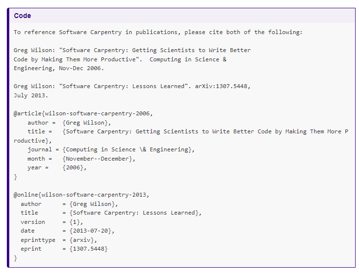

# 1 Automated Version Control

## 'Final' doc

   


## Recording your progress


## 2 people 2 versions


## 2 people 1 version


# 2 Setting up git

`git config --global user.name "Vlad Dracula" ` 
`git config --global user.email "vlad@tran.sylvan.ia" `  


On macOS and Linux:  `git config --global core.autocrlf input`    
 
And on Windows:    `git config --global core.autocrlf true`   
<br>
<br>
<br>
<br>

## Text editors


# 3 Creating a repository

## Exercise 3.1
Dracula would also like to track information about moons. He createas a `moons` directory inside `planets`:
```bash
$ cd ~/Desktop   # return to Desktop directory
$ cd planets     # go into planets directory, which is already a Git repository
$ ls -a          # ensure the .git subdirectory is still present in the planets directory
$ mkdir moons    # make a subdirectory planets/moons
$ cd moons       # go into moons subdirectory
$ git init       # make the moons subdirectory a Git repository
$ ls -a          # ensure the .git subdirectory is present indicating we have created a new Git repository
```

Is the `git init` command, run inside the moons subdirectory, required for tracking files stored in the moons subdirectory?

<details>
<summary>Solution</summary>

No. Dracula does not need to make the moons subdirectory a Git repository because the planets repository will track all files, sub-directories, and subdirectory files under the planets directory. If you do create nested Git repositories they can interfere with each other as the outer repo will try to version-control the inner.    
<br>
<br>

If you want to check whether something is already under version control you can naviagte to the directory, run `git status` and if there is no existing information there, you are OK to go ahead and run ` git init`. 

</details>

<br>
<br>
<br>
<br>

# 4 Tracking changes
 
 
 
<br>
<br>
<br>
<br>

 ## Exercise 4.1 Choosing a commit message
 
 Which is the most appropriate commit message and why?
 
 1. “Changes”
 2. “Added line ‘But the Mummy will appreciate the lack of humidity’ to mars.txt”
 3. “Discuss effects of Mars’ climate on the Mummy”
 
 <details>
 <summary>Solution</summary>
<ol>
<li>Not descriptive enough.</li>
<li>Redundant, can use git diff to view exactly what line was added.</li>
<li>Short and descriptive.</li>
</ol> 

 </details>


<br>
<br>
<br>
<br>


## Exercise 4.2 Commiting changes
Which command(s) below would save the changes of myfile.txt to my local Git repository?

1. `commit -m "my recent changes"`
2. `git init myfile.txt`   
`git commit -m "my recent changes"`
3. `git add myfile.txt`    
 `git commit -m "my recent changes"`
4. `git commit -m myfile.txt "my recent changes"`

 <details>
 <summary>Solution</summary>
<ol>
<li>Would only create a commit if files have already been staged.</li>
<li>Would try to create a new repository</li>
<li>Is correct: first add the file to the staging area, then commit.</li>
<li>Would try to commit a file “my recent changes” with the message myfile.txt.</li>
</ol> 

 </details>


<br>
<br>
<br>
<br>


## Exercise 4.3 Committing multiple files
The staging area can hold changes from any number of files that you want to commit as a single snapshot.

1. Add some text to `mars.txt` noting your decision to consider Venus as a base
2. Create a new file `venus.txt` with your initial thoughts about Venus as a base for you and your friends
3. Add changes from both files to the staging area, and commit those changes.

 <details>
 <summary>Solution</summary>
<ol style="list-style-type:none;">
  <li>Make changes to mars.txt (nano mars.txt)</li>
  <li>Create and make changes to venus.txt (nano venus.txt)</li>
  <li>Add files to staging area in one command or separately (git add mars.txt venus.txt)</li>
  <li>Commit</li>
</ol>  

 </details>


<br>
<br>
<br>
<br>


# 5 Exploring history

## Exercise 5.1
Jennifer has made changes to the Python script she has been working on for weeks, and the modifications she made broke the script, and it no longer runs. 

Which commands will let her recover the last committed version of her Python scrip called `data-cruncher.py`?

1. `git checkout HEAD`   
2. `git checkout HEAD data_cruncher.py`    
3. `git checkout HEAD~1 data_cruncher.py`   
4.` git checkout <unique ID of last commit> data_cruncher.py`      
5. Both 2 and 4

 <details>
 <summary>Solution</summary>
 Both 2 and 4 are correct.
<ol >
  <li>Dangerous, without a file name git checkout restores all files, and you are left in detached head state. 
</li>
  <li>Uses HEAD to indicate the latest commit and specifies the file to be restored.</li>
  <li>Gets version before the latest, which we don’t want.
  </li>
  <li>Uses the unique identifier of the last commit and specifies the file to be restored.</li>
</ol>  

 </details>

<br>
<br>
<br>
<br>

## Exercise 5.2 Reverting a commit
Jennifer is collaborating with colleagues on her Python script. She realizes her last commit to the project’s repository contained an error, and wants to undo it. Jennifer wants to undo correctly so everyone in the project’s repository gets the correct change. The command `git revert [erroneous commit ID]` will create a new commit that reverses the erroneous commit.

The command git revert is different from `git checkout [commit ID]` because `git checkout` returns the files not yet committed within the local repository to a previous state, whereas `git revert` reverses changes committed to the local and project repositories.

Below are the right steps and explanations for Jennifer to use git revert, what is the missing command?

1.  `________ # Look at the git history of the project to find the commit ID`
2. Copy the ID (the first few characters of the ID, e.g. 0b1d055).
3. `git revert [commit ID]`
4. Type in the new commit message.
5.Save and close

 <details>
 <summary>Solution</summary>
 
The command `git log` lists project history with commit IDs.

The command `git show HEAD` shows changes made at the latest commit, and lists the commit ID; however, Jennifer should double-check it is the correct commit, and no one else has committed changes to the repository. 

 </details>

<br>
<br>
<br>
<br>

# 6 Ignoring things

## Exercise 6.1 Ignoring nested files
Given a directory structure that looks like:    

`results/data`    
`results/plots`       

How would you ignore only `results/plots` and not `results/data`?    

<details>
 <summary>Solution</summary>
 
Add `results/plots/` to your `.gitignore` 

 </details>

<br>
<br>
<br>
<br>

## Exercise 6.2 Including specific files
How would you ignore all `.dat` files in your root directory except for `final.dat`? Hint: Find out what `!` (the exclamation point operator) does.
<details>
 <summary>Solution</summary>
 
 Add `*.dat` to ignore all data files and `!final.dat` to include `final.dat`

 </details>

<br>
<br>
<br>
<br>

## Exercise 6.3 The order of riles
Given a `.gitignore` file with the following contents:

`*.dat`   
`!*.dat`   

What will be the result?

<details>
 <summary>Solution</summary>
 
The `!` modifier will negate an entry from a previously defined ignore pattern. Because the `!*.dat` entry negates all of the previous `.dat` files in the `.gitignore`, none of them will be ignored, and all `.dat` files will be tracked.

 </details>

<br>
<br>
<br>
<br>


# 7 Remotes in GitHub


<br>
<br>
<br>
<br>

<br>
<br>
<br>
<br>


<br>
<br>
<br>
<br>

# 9  Conflicts

## Exercise 9.1
Put these steps in order to minimise the chances of conflicts;
* Make changes by appending the number 100 to a text file numbers.txt
* Update remote repository to match the local repository
* Celebrate your success with some fancy beverage(s)
* Update local repository to match the remote repository
* Stage changes to be committed
* Commit changes to the local repository

If you have time, add the git commands you would need to use.

<details>
 <summary>Solution</summary>
 

1. Update local - `git pull origin main`    
2. Make changes     
4. Commit changes - `git commit -m "Add 100 to numbers.txt"`    
5. Update remote - `git push origin main`    
6. Celebrate!    

 </details>

<br>
<br>
<br>
<br>

# 12 Citation



